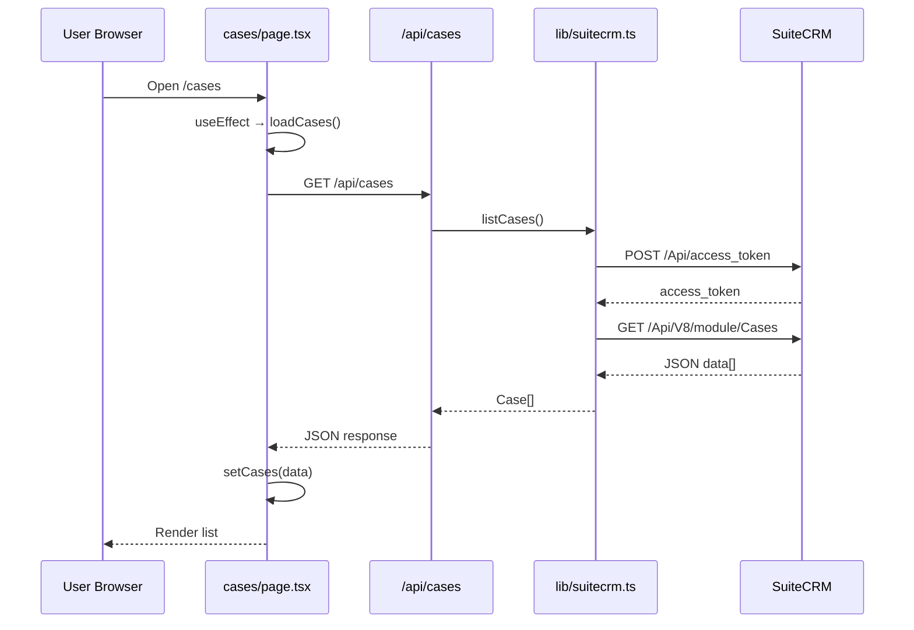

# Cases App — Next.js + SuiteCRM

A small web app that manages **Cases** in SuiteCRM. You can list, add, edit, and delete cases from a browser page. Data is stored in SuiteCRM (not in the Next.js app).

Built for beginners: the UI talks to **your** API routes, and those routes talk to **SuiteCRM V8 API**.

## Preview

**[Open guide in browser](https://htmlpreview.github.io/?https://github.com/Goals-2026-01-06/next-js-crud/blob/main/cases-app.html)**

Uses [GitHub HTML Preview](https://htmlpreview.github.io/) — scroll down to move through all slides.

## How to view

Open `cases-app.html` in any modern browser (Chrome, Edge, Firefox). Scroll down to move through slides. No build step or install required.

**Print to PDF** — use the browser print dialog (Ctrl+P). Each slide is styled to print on its own page.

## Slide overview

1. Title — Cases App  
2. What This App Does  
3. What You Need Before Starting  
4. Quick Start  
5. Project Structure  
6. Three Layers  
7. Environment Variables  
8. Field Mapping  
9. How Routing Works  
10. Does `/cases` Know `CasesPage`?  
11. What Runs When You Open `/cases`  
12. Special File Names  
13. API Routes Use `route.ts`  
14. Pages vs API Routes  
15. Flow 1: Load List  
16. Flow 2: Add a Case  
17. Flow 3: Edit a Case  
18. Flow 4: Delete a Case  
19. What Triggers What (cheat sheet)  
20. Inside `lib/suitecrm.ts`  
21. OAuth Login  
22. React State  
23. Why `"use client"`?  
24. One Request End-to-End  
25. Common Problems  
26. Scripts & Concepts  
27. Full App Demo  
28. Learn More  

---

## What you need before starting


| Tool                  | Purpose                                          |
| --------------------- | ------------------------------------------------ |
| **Node.js** (v18+)    | Runs the Next.js app                             |
| **npm**               | Installs packages                                |
| **WAMP** (or similar) | Runs SuiteCRM on `http://localhost/SuiteCRM7151` |
| **SuiteCRM 7.15+**    | CRM with Cases module and V8 API enabled         |


---


## Quick start

```bash
# 1. Install dependencies
npm install

# 2. Copy env file and set your SuiteCRM password
copy env.example .env.local

# 3. Start Next.js
npm run dev
```

Open:

- App home: [http://localhost:3000](http://localhost:3000)
- Cases page: [http://localhost:3000/cases](http://localhost:3000/cases)

SuiteCRM must be running at the URL in `.env.local` (default: `http://localhost/SuiteCRM7151`).

---


## Project structure (what each file does)

```
my-application/
├── app/
│   ├── layout.tsx              # Wraps every page (HTML shell, loads CSS)
│   ├── page.tsx                # Home page at /
│   ├── globals.css             # Tailwind / global styles
│   ├── cases/
│   │   └── page.tsx            # Cases UI at /cases (form + list)
│   └── api/
│       └── cases/
│           ├── route.ts        # GET all cases, POST new case
│           └── [id]/
│               └── route.ts    # PATCH update, DELETE one case
├── lib/
│   └── suitecrm.ts             # Login + talk to SuiteCRM V8 API
├── .env.local                  # Secrets (NOT committed to git)
├── env.example                 # Template for .env.local
└── package.json                # Dependencies and scripts
```


### Important idea: three layers

```
┌─────────────────┐     ┌─────────────────┐     ┌─────────────────┐
│  Browser (UI)   │ ──► │  Next.js API    │ ──► │  SuiteCRM       │
│  /cases page    │     │  /api/cases     │     │  V8 REST API    │
│  React state    │     │  lib/suitecrm   │     │  MySQL database │
└─────────────────┘     └─────────────────┘     └─────────────────┘
```

1. **UI** (`app/cases/page.tsx`) — buttons, forms, list. Runs in the browser.
2. **API** (`app/api/cases/...`) — safe middle layer on the server. Hides passwords.
3. **SuiteCRM** (`lib/suitecrm.ts`) — real storage. Cases live in the CRM database.

The browser **never** calls SuiteCRM directly. It only calls `/api/cases`.

---


## Environment variables (`.env.local`)


| Variable                 | What it is                                                 |
| ------------------------ | ---------------------------------------------------------- |
| `SUITECRM_URL`           | Base URL of SuiteCRM, e.g. `http://localhost/SuiteCRM7151` |
| `SUITECRM_CLIENT_ID`     | OAuth2 client ID from SuiteCRM Admin                       |
| `SUITECRM_CLIENT_SECRET` | OAuth2 client secret                                       |
| `SUITECRM_USERNAME`      | SuiteCRM user (e.g. `admin`)                               |
| `SUITECRM_PASSWORD`      | That user's password                                       |


Create the OAuth client in SuiteCRM: **Admin → OAuth2 Clients and Tokens → Create Password Client**.

SuiteCRM also needs OAuth2 keys in `Api/V8/OAuth2/` (`private.key`, `public.key`). If API login fails with "Invalid key", generate those keys (see SuiteCRM V8 API docs).

---


## Field mapping (our app ↔ SuiteCRM)


| In the app (form / list) | SuiteCRM Cases field | Notes                                      |
| ------------------------ | -------------------- | ------------------------------------------ |
| `title`                  | `name`               | Case subject / title                       |
| `description`            | `description`        | Long text about the case                   |
| `status`                 | `status`             | See status table below                     |
| `id`                     | record `id`          | UUID; used for edit/delete, hidden in UI   |


### Status mapping

The dropdown shows simple labels. SuiteCRM stores different internal values:


| You see in app | SuiteCRM stores |
| -------------- | --------------- |
| Open           | `Open_New`      |
| In Progress    | `Open_Assigned` |
| Closed         | `Closed_Closed` |


Conversion happens in `lib/suitecrm.ts` using the `STATUSES` list and `appStatusToCrm` / `crmStatusToApp`.

---


## How routing works in Next.js (App Router)

Next.js does **not** connect URLs to component names like `CasesPage`. It uses **folders + special file names** under `app/`.

### The core rule

```
Folder path under app/  +  file named page.tsx  =  URL route
```


| File on disk         | URL in browser |
| -------------------- | -------------- |
| `app/page.tsx`       | `/`            |
| `app/cases/page.tsx` | `/cases`       |
| `app/about/page.tsx` | `/about`       |


So when you visit `http://localhost:3000/cases`, Next.js looks for:

```
app/cases/page.tsx
```

It does **not** search for a function named `CasesPage`. The name `CasesPage` is only for you — the developer.

### Does `/cases` “know” about `CasesPage`?

**No.** Here is what actually happens:

1. Browser requests `/cases`
2. Next.js maps the URL segment `cases` → folder `app/cases/`
3. Next.js loads `page.tsx` inside that folder (this filename is required)
4. Next.js renders the `export default` function from that file
5. That output is wrapped inside `app/layout.tsx`

In your code:

```tsx
// app/cases/page.tsx
export default function CasesPage() {
  // ...
}
```

- `export default` = “use this component for this route”
- `CasesPage` = optional label; could be renamed to `Cases`, `Foo`, etc. without changing the URL

This would still serve `/cases`:

```tsx
export default function Cases() {
  return <main>...</main>;
}
```


### What runs when you open `/cases` (step by step)

```
http://localhost:3000/cases
        │
        ▼
Next.js router matches URL segment "cases"
        │
        ▼
Finds app/cases/page.tsx
        │
        ▼
Renders default export (CasesPage component)
        │
        ▼
Wraps it in app/layout.tsx as {children}
        │
        ▼
Final HTML sent to browser
```

`app/layout.tsx` wraps **every** page:

```tsx
export default function RootLayout({ children }) {
  return (
    <html lang="en">
      <body>{children}</body>   {/* CasesPage output goes here */}
    </html>
  );
}
```


### Special file names you must remember


| File name                         | Purpose                        | Creates a URL?       |
| --------------------------------- | ------------------------------ | -------------------- |
| `page.tsx`                        | UI for a route                 | **Yes**              |
| `layout.tsx`                      | Shared wrapper around pages    | No (wraps routes)    |
| `route.ts`                        | API endpoint (GET, POST, etc.) | **Yes** (`/api/...`) |
| `list.tsx`, `CasesList.tsx`, etc. | Normal module/component file   | **No**               |


That is why `app/cases/list.tsx` did **not** create `/cases` and returned **404** until `app/cases/page.tsx` was added. Only `page.tsx` defines a page route.

### API routes use `route.ts`, not `page.tsx`

API URLs work the same way (folder path = URL), but the file must be named `route.ts` and export HTTP method functions:


| URL                         | File                          | Exported function                |
| --------------------------- | ----------------------------- | -------------------------------- |
| `GET /api/cases`            | `app/api/cases/route.ts`      | `export async function GET()`    |
| `POST /api/cases`           | `app/api/cases/route.ts`      | `export async function POST()`   |
| `PATCH /api/cases/abc-123`  | `app/api/cases/[id]/route.ts` | `export async function PATCH()`  |
| `DELETE /api/cases/abc-123` | `app/api/cases/[id]/route.ts` | `export async function DELETE()` |


`[id]` is a **dynamic segment** — any value in that part of the URL becomes `id` in code:

```
/api/cases/00f7af56-2ace-42c8-b39a-e63acfa38fb5
              └──────────────── id ────────────────┘
```


### Pages vs API routes in this project


| Kind      | Example URL  | File                     | Runs where                 |
| --------- | ------------ | ------------------------ | -------------------------- |
| Page (UI) | `/cases`     | `app/cases/page.tsx`     | Browser (client component) |
| API       | `/api/cases` | `app/api/cases/route.ts` | Server only                |


The cases **page** calls the cases **API** with `fetch("/api/cases")`. They are separate routes with separate files.

### Mental model (beginner)

```
URL path        = folder path under app/
Page UI         = default export in page.tsx
API handler     = GET/POST/PATCH/DELETE in route.ts
Component name  = for humans only; router ignores it
```


### Quick reference table


| URL                         | File                                              | What runs                                   |
| --------------------------- | ------------------------------------------------- | ------------------------------------------- |
| `/`                         | `app/page.tsx`                                    | Home page                                   |
| `/cases`                    | `app/cases/page.tsx`                              | Cases page (`export default` → `CasesPage`) |
| `GET /api/cases`            | `app/api/cases/route.ts` → `GET` function         |                                             |
| `POST /api/cases`           | `app/api/cases/route.ts` → `POST` function        |                                             |
| `PATCH /api/cases/abc-123`  | `app/api/cases/[id]/route.ts` → `PATCH` function  |                                             |
| `DELETE /api/cases/abc-123` | `app/api/cases/[id]/route.ts` → `DELETE` function |                                             |


---


## Full application flows


### Flow 1: Open `/cases` (load list)

**Trigger:** User opens `http://localhost:3000/cases` (or page loads after navigation).

```
User opens /cases
    │
    ▼
Next.js loads app/cases/page.tsx (see "How routing works" above)
    │
    ▼
CasesPage component mounts in browser
    │
    ▼
useEffect runs once → loadCases()
    │
    ▼
fetch("GET /api/cases")
    │
    ▼
app/api/cases/route.ts → GET()
    │
    ▼
lib/suitecrm.ts → listCases()
    │
    ├─► getToken()  → POST SuiteCRM /Api/access_token (OAuth login)
    │
    └─► crmFetch()  → GET SuiteCRM /Api/V8/module/Cases?...
            │
            ▼
        Each CRM record → toCase() (map fields + status)
            │
            ▼
        JSON array returned to browser
            │
            ▼
setCases(data) → list renders on screen
```

**State changes on the page:**

- `loading` → `true` then `false`
- `cases` → filled with array from API
- `error` → set if request fails

---


### Flow 2: Add a new case

**Trigger:** User fills form and clicks **Add**.

```
User clicks Add (form submit)
    │
    ▼
handleSubmit() — e.preventDefault()
    │
    ├─ Validates: title must not be empty
    │
    ▼
fetch("POST /api/cases", body: { title, description, status })
    │
    ▼
app/api/cases/route.ts → POST()
    │
    ▼
lib/suitecrm.ts → createCase(body)
    │
    ├─► toCrmFields() — title→name, status→Open_New etc.
    │
    └─► crmFetch("POST /Api/V8/module", { type: "Cases", attributes: ... })
            │
            ▼
        SuiteCRM saves row in `cases` table
            │
            ▼
        Response → toCase() → one Case object with new id
            │
            ▼
Browser: setCases([...cases, data])
    │
    ▼
clearForm() — reset inputs, editingId = null
```

---

### Flow 3: Edit a case

**Trigger:** User clicks **Edit** on a list row.

```
User clicks Edit
    │
    ▼
handleEdit(case)
    │
    ├─ setEditingId(case.id)     ← remembers which row we edit
    ├─ setTitle, setDescription, setStatus from that case
    │
    ▼
Form shows "Update case" and Save button
```

**Trigger:** User changes fields and clicks **Save**.

```
User clicks Save
    │
    ▼
handleSubmit()
    │
    ▼
fetch("PATCH /api/cases/{editingId}", body: { ... })
    │
    ▼
app/api/cases/[id]/route.ts → PATCH()
    │
    ▼
lib/suitecrm.ts → updateCase(id, body)
    │
    └─► crmFetch("PATCH /Api/V8/module", { data: { type, id, attributes } })
            │
            ▼
Browser: replace that item in cases array
    │
    ▼
clearForm()
```

---


### Flow 4: Delete a case

**Trigger:** User clicks **Delete** on a list row.

```
User clicks Delete
    │
    ▼
handleDelete(id)
    │
    ▼
fetch("DELETE /api/cases/{id}")
    │
    ▼
app/api/cases/[id]/route.ts → DELETE()
    │
    ▼
lib/suitecrm.ts → deleteCase(id)
    │
    └─► crmFetch("DELETE /Api/V8/module/Cases/{id}")
            │
            ▼
Browser: setCases(cases.filter(...))  — remove from list
```

If you were editing that same case, `clearForm()` runs too.

---


## What triggers what (cheat sheet)


| User action | Function in page          | HTTP call                   | API route                   | suitecrm function |
| ----------- | ------------------------- | --------------------------- | --------------------------- | ----------------- |
| Page load   | `useEffect` → `loadCases` | GET `/api/cases`            | `GET` in `route.ts`         | `listCases()`     |
| Add         | `handleSubmit`            | POST `/api/cases`           | `POST` in `route.ts`        | `createCase()`    |
| Save edit   | `handleSubmit`            | PATCH `/api/cases/:id`      | `PATCH` in `[id]/route.ts`  | `updateCase()`    |
| Delete      | `handleDelete`            | DELETE `/api/cases/:id`     | `DELETE` in `[id]/route.ts` | `deleteCase()`    |
| Edit        | `handleEdit`              | *(none — only local state)* | —                           | —                 |
| Cancel      | `clearForm`               | *(none)*                    | —                           | —                 |


---


## Inside `lib/suitecrm.ts` (SuiteCRM layer)


| Function        | Job                                                                           |
| --------------- | ----------------------------------------------------------------------------- |
| `getToken()`    | Logs into SuiteCRM with OAuth2 password grant. Caches token until it expires. |
| `crmFetch()`    | Adds `Authorization: Bearer ...` header and calls any V8 endpoint.            |
| `readJson()`    | Parses JSON from SuiteCRM (handles messy local WAMP responses).               |
| `toCase()`      | CRM record → our `Case` shape.                                                |
| `toCrmFields()` | Our form data → CRM field names.                                              |
| `listCases()`   | GET all cases.                                                                |
| `createCase()`  | POST new case.                                                                |
| `updateCase()`  | PATCH existing case.                                                          |
| `deleteCase()`  | DELETE case.                                                                  |


### OAuth login (happens automatically)

Before any Cases API call, `crmFetch` calls `getToken()`:

1. POST to `{SUITECRM_URL}/Api/access_token`
2. Body: `grant_type=password`, client id/secret, username/password
3. Response: `access_token` (valid ~1 hour)
4. Token is reused until near expiry

---


## React state on the cases page


| State                                        | Purpose                                                  |
| -------------------------------------------- | -------------------------------------------------------- |
| `cases`                                      | List shown on screen (copy of CRM data)                  |
| `title`, `description`, `status` | Form inputs                                              |
| `editingId`                                  | `null` = adding new; otherwise UUID of case being edited |
| `loading`                                    | `true` while fetching list                               |
| `saving`                                     | `true` while POST/PATCH in progress                      |
| `error`                                      | Error message string shown in red box                    |


Data in React state is **temporary**. Refresh the page → `loadCases()` runs again → data reloads from SuiteCRM.

---


## Why `"use client"` on the cases page?

`app/cases/page.tsx` starts with `"use client"` because it uses:

- `useState`, `useEffect`
- `onClick`, `onChange`, form `onSubmit`

In Next.js App Router, files without `"use client"` are **Server Components** and cannot use browser hooks or events.

API routes (`app/api/...`) always run on the **server** — they can read `.env.local` safely.

---


## Diagram: one request end-to-end (example: list cases)




---


## Common problems


| Problem                   | What to check                                                       |
| ------------------------- | ------------------------------------------------------------------- |
| 404 on `/cases`           | File must be `app/cases/page.tsx`                                   |
| "Missing SUITECRM_..."    | Create `.env.local` from `env.example`                              |
| Login failed              | Client id/secret, username/password, OAuth keys in SuiteCRM         |
| API returns HTML not JSON | WAMP xdebug — `Api/.htaccess` should disable display_errors for API |
| Empty list                | No cases in SuiteCRM yet, or wrong CRM URL                          |
| Status wrong after save   | Check `STATUSES` mapping in `lib/suitecrm.ts`                       |


---


## Scripts

```bash
npm run dev    # Development server (http://localhost:3000)
npm run build  # Production build
npm run start  # Run production build
npm run lint   # ESLint
```

---


## Concepts to learn from this project

1. **CRUD** — Create, Read, Update, Delete
2. **REST API** — HTTP methods GET, POST, PATCH, DELETE
3. **BFF pattern** — Backend-for-frontend (`/api/cases` hides CRM secrets)
4. **OAuth2** — Token-based login to SuiteCRM
5. **Field mapping** — Different names in UI vs external system
6. **React state** — UI memory vs persistent database
7. **Next.js App Router** — `page.tsx` for routes, `route.ts` for APIs

---


## Learn more

- [Next.js Documentation](https://nextjs.org/docs)
- [SuiteCRM V8 API](https://docs.suitecrm.com/developer/api/developer-setup-guide/json-api/)

